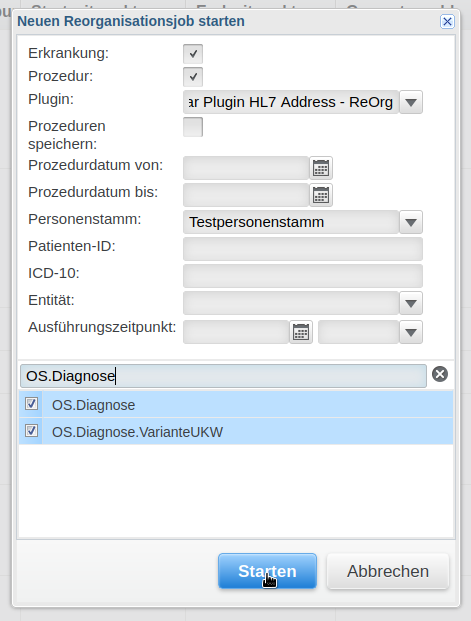

# Onkostar Plugin für HL7 Adressen

Dieses Onkostar-Plugin ermöglicht das Verarbeiten von Adressen in HL7 Nachrichten und das automatische Aufteilen von
Straße und Hausnummer.

## Eigenschaften des Plugins

### Nutzung nach Anwendung einer HL7-Nachricht

Das Plugin wird nach der internen Verarbeitung der HL7-Nachricht durch Onkostar ausgeführt.

Das bedeutet, dass bereits immer eine Anschrift, hier zunächst mit Straße und Hausnummer im Formularfeld "Straße" für
einen Patienten vorhanden ist.

Neue Patienten werden im jeweils konfigurierten Personenstamm ebenfalls vor Ausführung des Plugins angelegt und sind
daher bereits in der Datenbank vorhanden.

### Nutzung für eine Reorganisation

Das Plugin kann auch für eine Reorganisation verwendet werden.

_Leider ist es nicht möglich, ein Patienten-Analyzer-Plugin zu implementieren, da dafür benötigte Teile nicht über die
Onkostar-API bereitgestellt werden. Das Plugin verwendet daher die Diagnose-Formulare, um alle Patienten zu reorganisieren._  

Wählen Sie hierzu zunächst eine Plugin-Reorganisation aus.

Stellen Sie sicher, dass ein Haken bei "Erkrankung" gesetzt ist.
Danach wählen Sie das Plugin "Onkostar Plugin HL7 Address - ReOrg" aus, den Personenstamm und die für Sie relevanten
Diagnose-Formulare. 

Sie können die Ausführung zudem über Angaben zum Prozedurdatum einschränken.



Nach dem Durchlauf der Reorganisation sind - sofern möglich - die Straße und Hausnummer der Patienten
mit einer Diagnose getrennt.

#### Hinweis zum Übernehmen von Hausnummern aus einer HL7-Nachricht

Ist für einen Patienten eine Straße und Hausnummer angegeben, wird durch den Import einer HL7-Datei die darin enthaltene
Angabe für `<streetAddress>` mit Straße und Hausnummer in das Formularfeld für die Straße eingefügt.

**Die zuvor bereits vorhandene Hausnummer wird im Formularfeld für die Hausnummer (Version 2.12.1) so belassen.**

Aus diesem Grund überschreibt das Plugin bei einer Reorganisation immer dann die - nun veraltete - Hausnummer, sofern
in der neuen Angabe im Formularfeld für die Straße eine Hausnummer erkannt wurde.
Nach der Reorganisation ist somit im Formularfeld für die Straße nur die neue Straße, im Formularfeld für die
Hausnummer nur die neue Hausnummer eingetragen.

### HL7-Anschrift und Aufteilung in Straße und Hausnummer

In HL7-Nachrichten liegen die Anschriften immer in der folgenden Form vor:

```
<streetAddress>^<otherDesignation>^<city>^<state>^<postalCode>^<country>
```

Das Plugin teilt dabei zunächst die Anschrift in die einzelnen Bestandteile auf.
In HL7 ist eine Aufteilung von Straße und Hausnummer nicht vorgesehen, beide Angaben stehen zusammen im Bereich `<streetAddress>`. 

Die weitere Aufteilung des Bereichs `<streetAddress>` erfolgt mithilfe eines regulären Ausdrucks:

```
(?<streetName>[^,]+)+[,\s]+(?<houseNumber>([0-9]+[A-Za-z\s\-/]*)*)$
```

* `streetName` → Alle Zeichen möglich, gefolgt von einem (oder mehreren) abschließenden Leerzeichen oder Komma
* `houseNumber` → Der Rest der Zeichenkette bis zum Ende (`$`) muss dabei aus einer (optionalen, falls Hausnummer bereits da fehlt) Folge von:
   * mindestens einer Ziffer
   * gefolgt von jeweils optionalen Buchstaben (ohne Umlaute!), Leerzeichen, Bindestrichen oder Schrägstrichen bestehen

Sollte die Trennung von Straße und Hausnummer fehlschlagen, wird die Zeichenkette als Straße verwendet.

## Tests

Dem Plugin liegt eine Datei mit 500 Testanschriften bei, die für UnitTests verwendet werden.